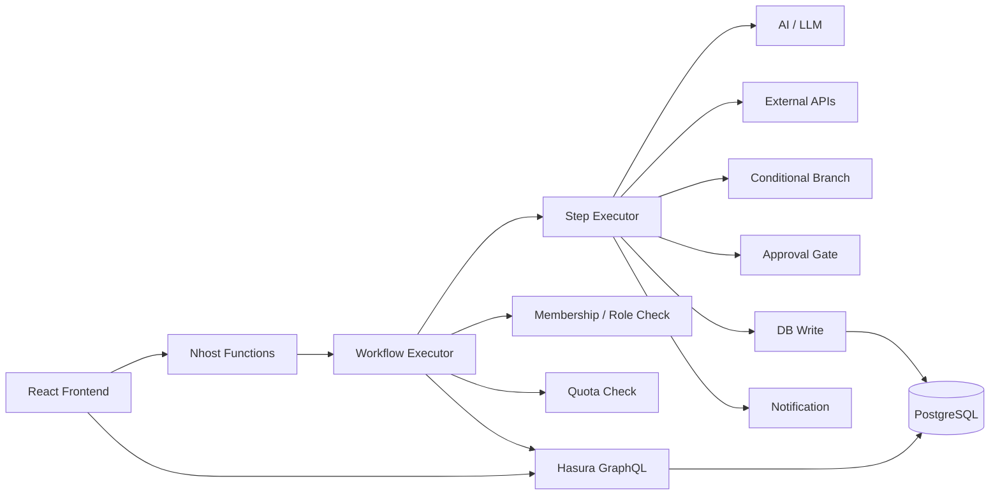
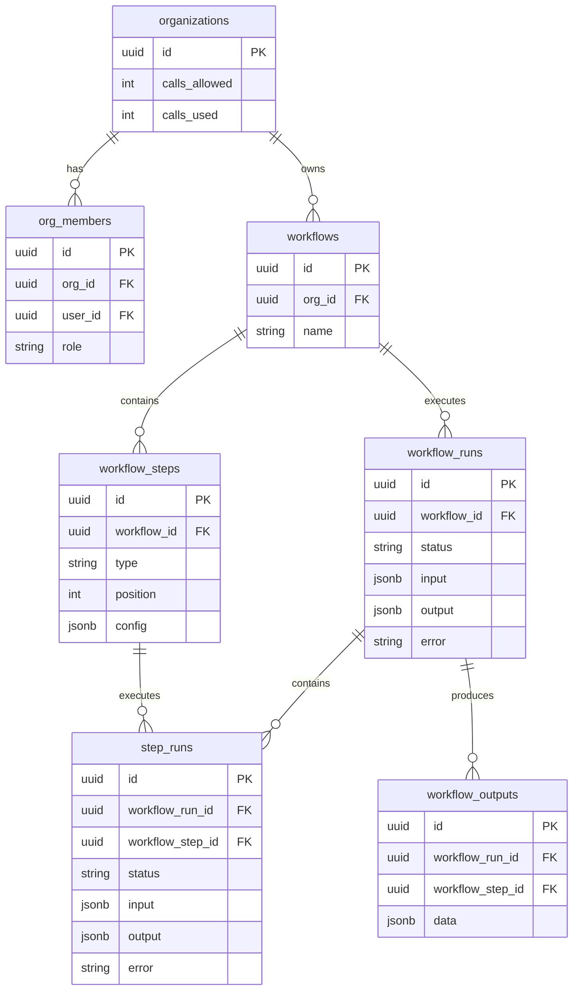

# AI Workflow Builder

A full-stack workflow automation system built with **Nhost, Hasura, PostgreSQL, GraphQL, Node.js, and React**.

The system allows users to define workflows as ordered steps and execute them with AI processing, HTTP requests, conditional branching, human approval, database persistence, notifications, execution history, quota checks, and organization-level authorization.

---

## Architecture



### Execution flow

```text
Request
  ↓
Load workflow + steps
  ↓
Check organization membership
  ↓
Check quota
  ↓
Create workflow_run
  ↓
Execute steps sequentially
  ↓
Create / complete / fail / pause step_runs
  ↓
Complete / fail / pause workflow_run
```

---

## Tech Stack

| Technology | Purpose |
|---|---|
| React | Frontend |
| Node.js 18+ | Workflow execution |
| Nhost | Backend platform and serverless functions |
| Hasura | GraphQL API and authorization |
| PostgreSQL | Persistent data |
| GraphQL | Application/database communication |
| LLM integration | AI workflow steps |
| REST/HTTP | External API integration |

---

## Database Model

The system separates workflow definitions from execution state.



---

## Supported Workflow Steps

```text
input
ai / llm_call
http / http_request
conditional_branch / condition
approval_gate / approval
db_write
notify / notification
```

Steps execute according to:

```text
workflow_steps.position ASC
```

Each execution creates a `workflow_run`, while each executed step creates a `step_run`.

---

## Example Workflow

```text
Receive Customer Request
          ↓
Classify Request
          ↓
Fetch External Data
          ↓
Order Branch
       ↙     ↘
    true     false
      ↓
Manager Approval
      ↓
Save Result
      ↓
Notify Support
```

Example input:

```json
{
  "customer_message": "I need help with my order"
}
```

The current AI fallback returns:

```json
{
  "_stubbed": true,
  "category": "order",
  "confidence": 0.75
}
```

The condition selects the appropriate branch using `_branch`.

---

## Approval / Resume

Approval gates use persistent state rather than keeping a serverless process alive.

```text
RUNNING
   ↓
PAUSED
   ↓
Human Approval
   ↓
RUNNING
   ↓
COMPLETED
```

The approval function validates the user's organization membership/role, completes the approval step, and resumes the remaining workflow.

---

## Error Handling

Individual steps are protected with `try/catch`.

```text
Execute step
    ↓
 success → completed
    ↓
 failure → step_runs.error
             ↓
         workflow_runs.error
```

HTTP requests also support retry handling. A remote `HTTP 503` is retried before the workflow is marked failed.

---

## Authorization

Authorization is designed in two layers:

```text
Layer 1: Hasura row-level permissions
                ↓
Layer 2: Node.js membership / role checks
                ↓
           Workflow Executor
```

Planned organization roles:

```text
owner
editor
viewer
```

The security boundary is based on:

```text
user → org_members → organization → workflow → workflow_run → step_run
```

> The application-level checks are implemented. The custom Hasura `owner/editor/viewer` row permissions still need to be fully configured and exported.

---

## GraphQL Operations

GraphQL operations are centralized under:

```text
functions/workflow-execution/graphql/
```

Main queries:

```text
GetWorkflowWithSteps
GetMembership
GetOrgQuota
GetStepRun
```

Main mutations cover:

```text
workflow run creation/update
step run creation/completion/failure/pause
approval
quota update
workflow output persistence
```

This keeps persistence logic separate from workflow step implementations.

---

## Project Structure

```text
ai-workflow-builder/
├── functions/
│   ├── workflow-execution/
│   │   ├── executor/
│   │   ├── graphql/
│   │   └── steps/
│   ├── approve-step/
│   ├── run-workflow.js
│   ├── test-graphql.js
│   └── test-server.js
├── database/
├── hasura/
├── frontend/
└── README.md
```

---

## Testing

Install dependencies:

```bash
cd functions
npm install
```

Test GraphQL connectivity:

```bash
node test-graphql.js
```

Run the workflow:

```bash
node run-workflow.js
```

Test approval/resume:

```bash
node test-server.js
```

The implementation has been verified against the Nhost/Hasura backend with successful:

```text
GetWorkflowWithSteps
GetMembership
GetOrgQuota
CreateWorkflowRun
CreateStepRun
CompleteStepRun
PauseStepRun
PauseWorkflowRun
ApproveStepRun
ResumeWorkflowRun
DbWriteOutput
UpdateWorkflowRun
```

A complete execution was also verified with:

```json
{
  "status": "completed",
  "error": null
}
```

---

## Current Status

### Working

- Sequential workflow execution
- Multiple step types
- AI fallback/stub
- HTTP requests
- Conditional branching
- Human approval and resume
- DB output persistence
- Notifications
- Workflow/step execution history
- Quota checks
- Application-level membership checks
- Error handling and HTTP retries
- GraphQL integration

### Remaining

- Configure Hasura `owner/editor/viewer` row permissions
- Test cross-organization isolation with a second organization/user
- Export Hasura metadata/migrations
- Wire `triggerWorkflowRun` and `approveStep` as Hasura Actions
- Replace client-supplied `user_id` with authenticated Nhost session/JWT identity
- Add secure webhook trigger
- Complete frontend integration

---

## Engineering Focus

The project emphasizes:

**Backend Engineering · GraphQL · Database Design · Authorization · Workflow State Machines · Serverless Architecture · API Integration · Error Handling · Extensible Step Execution**

---

## Author

**Nithin B**